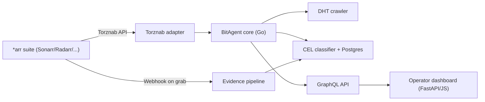

[](https://github.com/gekleos/bitagent/releases) [](https://github.com/gekleos/bitagent/actions) [](LICENSE)

# BitAgent

Turn raw DHT noise into ground-truthed torrent metadata for your Sonarr and Radarr stacks.

**What BitAgent is:**
- A self-hosted, high-performance BitTorrent DHT crawler and content indexer
- A Torznab-compatible provider that speaks natively to Sonarr, Radarr, Prowlarr, Lidarr, and Readarr
- A self-improving evidence pipeline that uses *arr webhook feedback to continuously prune false positives

## Quick start

Spin up BitAgent in under five minutes. Default authentication uses a simple API key.

```bash
# Generate auth secrets
DASHBOARD_API_KEY=$(openssl rand -hex 32)
TORZNAB_API_KEY=$(openssl rand -hex 32)

# Pull the compose file
curl -O https://raw.githubusercontent.com/gekleos/bitagent/main/examples/compose.public.yml

# Edit .env, then:
docker compose -f compose.public.yml up -d
```

Wait ~3 minutes for the first DHT bootstrap, then open `http://localhost:8080` and use the API key to log in.

Full quickstart: [docs/quickstart.md](docs/quickstart.md)

## Architecture



The Go core orchestrates DHT traffic, applies CEL-based classification, and persists results to Postgres. The Torznab adapter translates *arr queries into DHT searches and returns normalized metadata. The evidence pipeline ingests successful download webhooks to prune low-quality releases and recalibrate classifier thresholds.

## Configuration

Full reference at [docs/configuration.md](docs/configuration.md). Six core env vars cover most deployments:

- `DATABASE_URL` — Postgres connection string
- `DASHBOARD_API_KEY` — dashboard auth (set, or auto-generated on first run)
- `TORZNAB_API_KEY` — Torznab endpoint auth (set this for any public-internet deployment)
- `BITAGENT_LOG_LEVEL` — `debug` / `info` / `warn` / `error`
- `BITAGENT_DHT_BIND_ADDR` — DHT UDP bind (default `:4413`)
- `TMDB_API_KEY` — optional, enables Library poster art

## Integrations

Configure your *arr stack by adding a Torznab indexer:

- **Sonarr:** Indexers → Add → Torznab → URL `http://bitagent:3333/torznab` + your `TORZNAB_API_KEY`
- **Radarr:** same shape
- **Prowlarr:** add as a Newznab provider with the same URL/key
- **Lidarr / Readarr:** same Torznab pattern

## Status

This is the first public release. Watch the repo for v1.0.0 RC tags and follow [Discussions](https://github.com/gekleos/bitagent/discussions) for roadmap input.

## Roadmap

Tracked in GitHub Discussions. Current focus:
- Multi-region DHT crawling mesh
- CEL rule editor (visual builder in the dashboard)
- Magnet sanitization + torrent health scoring
- Mobile-responsive dashboard
- Native Plex/Jellyfin metadata export

## License & acknowledgments

MIT — see [LICENSE](LICENSE).

BitAgent is a 2026 fork of [bitmagnet-io/bitmagnet](https://github.com/bitmagnet-io/bitmagnet). The upstream provided a sound foundation; we extend our gratitude to those contributors. The DHT protocol and BitTorrent ecosystem are the work of the broader open-source community.
