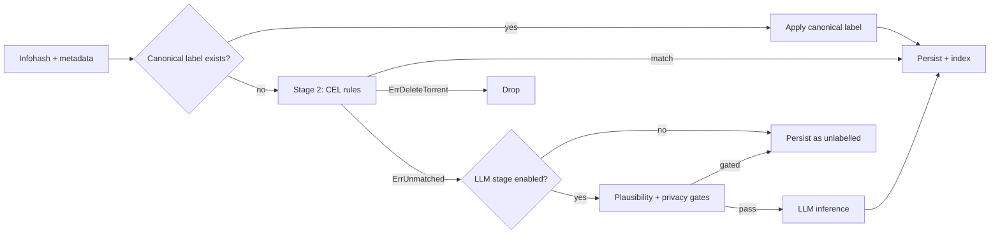

# Classification

BitAgent classifies every torrent it indexes — assigning a content type (`movie`, `tv_show`, `music`, etc.), a quality label, and a confidence score. Classification is what turns a raw DHT firehose into a usable Torznab feed.

The pipeline has three stages, each with its own purpose. They run in priority order and the first one that produces a definitive label wins.



## Why three stages

Each stage solves a different problem.

- **Canonical preempt** is *free*. If we already know what this infohash is — because Sonarr or Radarr just grabbed it as a specific episode — there's nothing to compute.
- **CEL rules** are *cheap and deterministic*. They handle the long tail of common cases (a release name with `S01E14` is a TV episode; a 50 MB `.mp3` is music) at <1 ms per torrent.
- **LLM rerank** is *expensive but specialised*. It handles ambiguous edge cases — a release name that doesn't fit any pattern, a torrent with mixed file types — at ~1 s per inference. Aggressively gated and aggressively cached, so most lookups are free.

In production, the typical mix is roughly: 20–30% canonical preempt, 65–75% CEL, 0–5% LLM (when the stage is enabled at all). The LLM stage is opt-in and disabled by default.

## Stage 1: Canonical-label preempt

Source: `internal/classifier/runner_canonical.go`.

A canonical label is a content-type label backed by ground truth — specifically, a successful `*arr` grab. When Sonarr grabs `Game.of.Thrones.S01E14.1080p.WEB-DL.mkv`, the evidence pipeline records that this exact infohash was identified as TV S01E14 of Game of Thrones. That row in `torrent_canonical_labels` is canonical: not a guess, an observation.

On every classifier run, the runner first checks `torrent_canonical_labels` by infohash. On hit, the canonical label is applied verbatim and the rest of the chain is skipped. On miss or lookup error, the chain falls through to Stage 2 — availability dominates over preempt benefits, so a transient DB blip doesn't break classification.

Metrics:

- `bitagent_classifier_preempt_lookup_total{result="hit|miss|error"}`
- `bitagent_classifier_preempt_apply_total`
- `bitagent_classifier_preempt_lookup_duration_seconds`

A healthy preempt hit ratio rises over time as your `*arr` clients accumulate grab history. New deployments start near 0% and grow toward 20–30% as the corpus matures.

## Stage 2: CEL classifier

Source: `internal/classifier/runner_canonical.go` (decorator) wraps the CEL runner in `internal/classifier`.

[CEL](https://github.com/google/cel-spec) (Common Expression Language) is Google's lightweight, sandboxed rules language. BitAgent's classifier ships with a curated CEL rule set — patterns over title, file paths, file size, file extension, and BEP-9-derived metadata.

Examples of the kinds of signals the rules look at:

- Title contains `S01E14` → TV episode
- Title regex matches `(\d{4})\s*(1080p|720p|2160p)` → release year + resolution
- File extension `.mp3` / `.flac` / `.wav` → music
- File extension `.epub` / `.azw3` / `.mobi` → ebook
- Size in expected range for the content type — a 50 MB "movie" is suspicious

Rules execute in deterministic priority order. The first match wins; the classifier exits immediately and the label is persisted.

Two terminating errors are special:

- `ErrUnmatched` — no rule fired. Falls through to the LLM stage if enabled, otherwise the torrent is persisted with no content-type label.
- `ErrDeleteTorrent` — the rule chain explicitly rejected this torrent (e.g., the `keywords.banned` regex caught a CSAM-class title). The torrent is dropped entirely, no row written.

You can inspect the live rules:

```bash
bitagent classifier show --format yaml
```

Rules are bundled in the binary; they are *not* user-editable at runtime. Rule changes ship as merge requests against the bitagent repo. After a rule change deploys, run `bitagent reprocess` to apply the new logic to already-indexed torrents.

Metrics:

- `bitagent_classifier_examined_total`
- `bitagent_classifier_decision_total{decision="..."}`
- `bitagent_classifier_duration_seconds`

## Stage 3: LLM rerank stage

Source: `internal/classifier/llmstage`.

The LLM rerank stage is a fallback for ambiguous torrents — the `ErrUnmatched` long tail that CEL couldn't classify. It is **disabled by default**. Enabling it requires a two-layer opt-in:

- `Enabled` — turn the stage on (defaults `false`).
- `EnableLive` — actually call the LLM (defaults `false`). With `Enabled=true, EnableLive=false`, the stage logs counterfactual metrics without calling out.

Even when enabled, the stage runs through a gate chain before any inference happens:

1. **Config gate.** Both flags must be true.
2. **Inner-unmatched gate.** CEL must have returned `ErrUnmatched`.
3. **Plausibility gate.** Torrent size, file count, and media extensions must pass sanity checks. A 1 GB single-file `.exe` torrent is not worth $0.001 of inference; the gate rejects it.
4. **Privacy gate.** `evidence.Store.IsPrivateInfoHash` is consulted. Private infohashes never go to the LLM. Fails closed on lookup error.

Inputs to the LLM are deliberately minimal:

- `title` (the release name)
- `file_list_hash` (a sha256 of the concatenated file paths — *not* the raw paths, for privacy)
- `size_bucket` (a coarsened size class, not the exact size)

Output is strict JSON, no chain-of-thought:

```json
{ "category": "movie", "confidence": 0.84 }
```

The `temperature` parameter is omitted from the request — the gpt-5 family rejects it, and we treat the model's reported confidence as a soft signal anyway.

Caching: every inference result is cached in a sha256 LRU keyed on `(model, prompt_version, title, file_list_hash, size_bucket)`. Repeat queries are free. A healthy cache hit ratio is `>0.5`; in production with stable prompts it climbs above 0.8.

Metrics:

- `bitagent_classifier_llm_invocations_total{result="success|gated|error"}`
- `bitagent_classifier_llm_cache_hits_total` / `..._cache_misses_total`
- `bitagent_classifier_llm_duration_seconds`
- `bitagent_classifier_llm_gates_total{stage="config|inner_unmatched|plausibility|privacy"}`

## Confidence

Each stage emits a confidence on `[0, 1]`:

- **Canonical preempt** — confidence `1.0`. It's ground truth.
- **CEL** — typically `0.7–0.95`, encoded per rule. Strong patterns score higher; loose heuristics score lower.
- **LLM** — the model's reported confidence, capped at `0.95` (we never trust an LLM's `1.0`).

The dashboard's Library tab uses these scores to colour-code rows. The Torznab response also exposes the score, so `*arr` Custom Formats can prefer high-confidence releases.

## Where labels surface

- **Torznab** — `<newznab:attr name="category" value="2040"/>` on each item.
- **GraphQL** — `TorrentContent.contentType` field; aggregations expose facet counts.
- **Dashboard** — Library tab, with confidence pill (green/yellow/grey).

## Reprocessing

After editing CEL rules — or after a major LLM prompt change — run reprocess to re-classify already-indexed torrents:

```bash
bitagent reprocess
```

The operation is idempotent and staged through the queue, so it can be safely interrupted and resumed. Watch progress via `bitagent_classifier_examined_total`.

## See also

- [Concepts / DHT crawler](dht-crawler.md)
- [Concepts / Wantbridge](wantbridge.md) — wants are derived from `*arr` grabs and reuse the canonical-label table
- [Reference / CLI](../reference/cli.md) — `classifier show`, `reprocess`
- [Reference / Metrics](../reference/metrics.md)
- [Configuration](../configuration.md)
