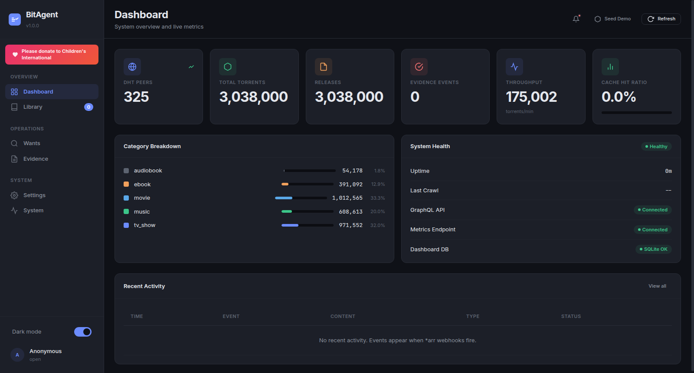
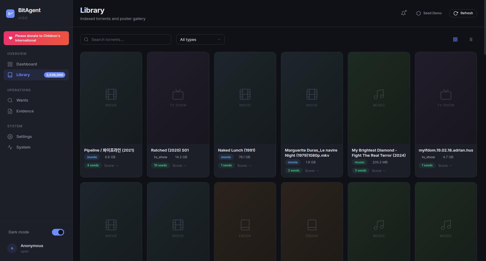
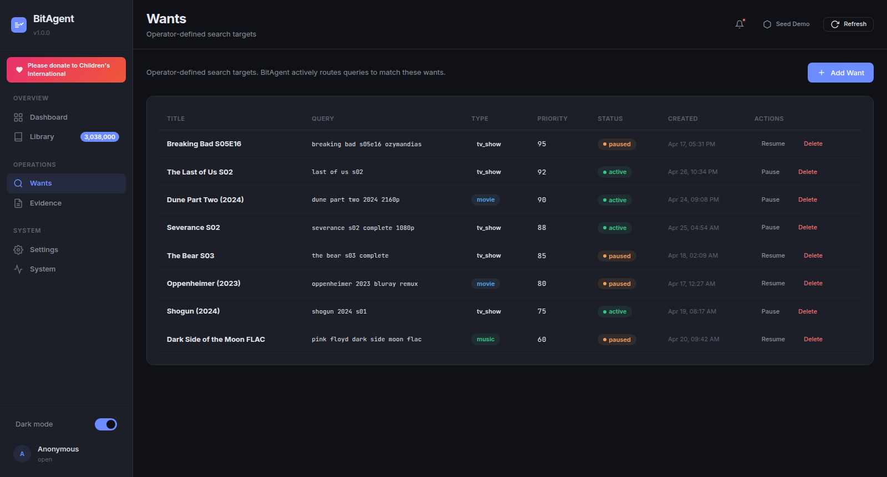
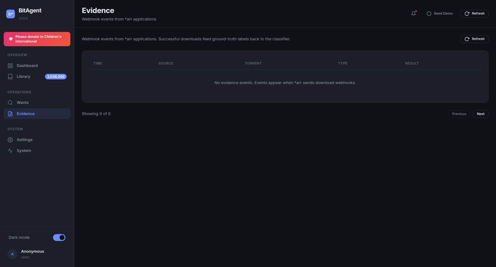
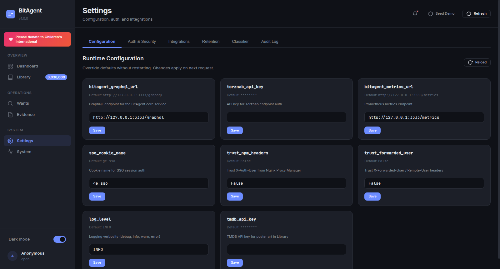
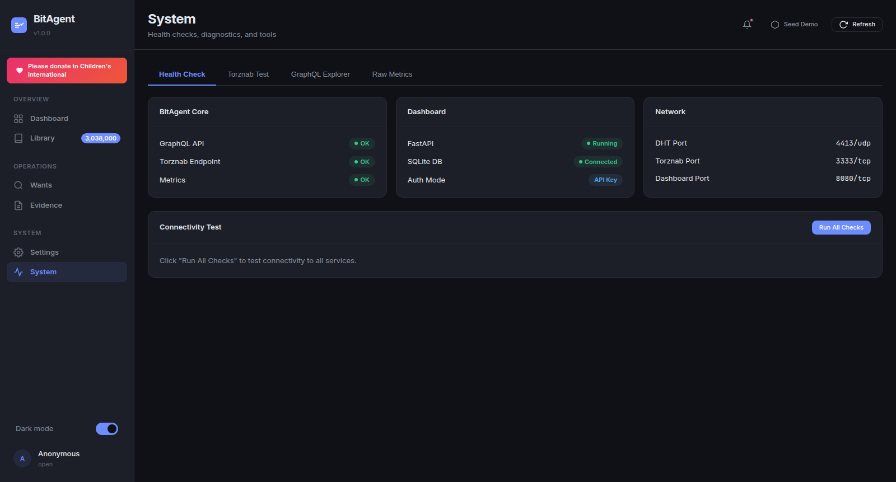

# Dashboard UI Guide

## Overview

The BitAgent v1.0.0 dashboard is the operator surface for the DHT crawler — live metrics, indexed catalogue, operator-defined search targets, *arr feedback, runtime configuration, and diagnostics, all in a single page. It is read-mostly: heavy mutations (settings overrides, want CRUD) are persisted to a local SQLite sidecar; everything else streams from the BitAgent core's GraphQL and Prometheus endpoints.

Use the dashboard for: confirming the crawler is healthy, telling BitAgent what content you actually want via Wants, verifying that *arr import webhooks are reaching the evidence pipeline, and troubleshooting connectivity from the System tab. The dashboard never bypasses the core — every change you make is via documented endpoints, so anything you can do here you can also script with `curl`.

## Layout

The interface is a left **sidebar** + top **header bar** + scrollable **main content area**. The sidebar is grouped:

- **OVERVIEW** — Dashboard, Library
- **OPERATIONS** — Wants, Evidence
- **SYSTEM** — Settings, System

A coral "Please donate to Children's International" banner sits at the top of the sidebar nav. The sidebar footer carries a **Dark mode** toggle (persists to `localStorage`) and a user avatar that renders the first letter of the authenticated `display` name with the auth method label below it. The wordmark in the top-left shows `BitAgent` and `v1.0.0`.

The header strip carries three controls in the top-right:

- **Notifications bell** — recent webhook delivery failures and crawler warnings.
- **Seed Demo** — POST to `/api/seed-demo`, populates wants / evidence / notifications with deterministic sample rows. Idempotent. Useful for screenshots and demos.
- **Refresh** — re-fetches the data for the visible tab only.

## Dashboard tab

The Dashboard tab is the at-a-glance health view.

The top row is six stat cards: **DHT PEERS**, **TOTAL TORRENTS**, **RELEASES**, **EVIDENCE EVENTS**, **THROUGHPUT** (torrents/min), **CACHE HIT RATIO**. Values update on each refresh tick (default 10s when not connected to SSE).

Below the stat cards, two side-by-side panels:

- **Category Breakdown** — share of the indexed catalogue by media type. Empty placeholder until the core has classified any content: *"Connect to BitAgent core to see category data."*
- **System Health** — a green **Healthy** badge plus rows for **Uptime**, **Last Crawl** timestamp, **GraphQL API** status, **Metrics Endpoint** status, **Dashboard DB** (`SQLite OK` / `SQLite ERROR`).

A **Recent Activity** table at the bottom (TIME / EVENT / CONTENT / TYPE / STATUS) shows the most recent 20 evidence events. *"View all"* in its top-right takes you to the Evidence tab. Empty state: *"No recent activity. Events appear when *arr webhooks fire."*

## Library tab

The Library is the indexed catalogue — every torrent the BitAgent core has classified and admitted. Search is text-only (free text matches title / infohash / category tags). The **All types** dropdown filters by classifier verdict (`movie`, `tv_show`, `music`, `ebook`). The grid/list view toggle in the top-right switches between a poster gallery (TMDB-fetched art when `TMDB_API_KEY` is set, text fallback otherwise) and a denser table.

Pagination is **Previous / Next** with a *"Showing X–Y of Z"* footer. The page size is fixed at 50.

Empty state: *"No torrents found. Adjust your search or wait for the DHT crawler to index content."*

When the BitAgent core has classified content, every row resolves to a [TorrentContent GraphQL object](reference/dashboard-api.md). Clicking a row reveals the infohash beneath the title — useful for `magnet:?xt=urn:btih:` links.

## Wants tab

Wants are the operator's voice in the indexer. Each want is a persistent search target (title, query string, type, priority 0–100, status). The classifier biases admission toward content that matches an active want — the same way a `*arr` quality profile biases its grabs.

Columns: **TITLE**, **QUERY**, **TYPE** (movie / tv_show / music / ebook badge), **PRIORITY** (integer 0-100, higher first), **STATUS** (`active` / `paused`), **CREATED**, **ACTIONS** (Pause/Resume + Delete).

Use **Add Want** in the top-right to create one — the modal exposes Title, Query (free-text, case-insensitive), Type dropdown, Priority slider (default 50). Pause keeps the row + history; Delete is permanent. See [Wants Guide](wants.md) for the API and priority semantics.

## Evidence tab

The Evidence tab is the read-only view of incoming `*arr` webhook events. Each row is one POST from Sonarr / Radarr / Lidarr / Readarr to `/api/evidence`. Columns: **TIME**, **SOURCE** (`sonarr` / `radarr` / `lidarr` badge), **TORRENT**, **TYPE** (`grab` / `download` / `import`), **RESULT** (`success` / `failed` / `duplicate`).

Empty state: *"No evidence events. Events appear when *arr sends download webhooks."*

This is the closed-loop feedback signal that distinguishes BitAgent from naïve Torznab providers — every successful import is a ground-truth label that flows back into classifier weights. See [Evidence Pipeline](evidence.md) for the full diagram and the `*arr` webhook configuration steps.

## Settings tab

Settings is the runtime configuration surface. Six sub-tabs:

- **Configuration** — the mutable runtime knobs (image above). One card per field: `torznab_api_key`, `bitagent_metrics_url`, `sso_cookie_name`, `tmdb_api_key`, `bitagent_graphql_url`, `trust_npm_headers`, `trust_forwarded_user`, `log_level`. Each card shows the current value, the `Default` line, a freeform input, and a Save button. Saved overrides apply on the next request — no restart.
- **Auth & Security** — toggle `REQUIRE_AUTH`, set/rotate `DASHBOARD_API_KEY`, configure SSO cookie name + lifetime.
- **Integrations** — Torznab base URL, TMDB API key, optional metric scrape targets.
- **Retention** — DHT routing-table TTL, evidence log retention, poster cache eviction interval.
- **Classifier** — heuristic weights, regex normalizers, NSFW filter strictness.
- **Audit Log** — append-only history of override changes, auth events, and health-state transitions. Read-only.

All cards on the Configuration sub-tab are backed by the `MUTABLE_FIELDS` allowlist in `config.py` — fields outside the allowlist (e.g. `host`, `port`, `db_path`) are not exposed here on purpose; they require a container restart to change.

## System tab

System is the diagnostics surface — open it any time the Dashboard tab looks wrong, or a Sonarr indexer test fails. Four sub-tabs:

- **Health Check** — three cards (BitAgent Core / Dashboard / Network) each with one-line status rows. The **Connectivity Test** panel underneath has a **Run All Checks** button that probes every endpoint synchronously and reports per-check latency.
- **Torznab Test** — submit a manual Torznab query (e.g. `?t=tvsearch&q=...&apikey=...`) against the configured BitAgent core. Useful when *arr says "0 results" but you suspect a filter / key issue.
- **GraphQL Explorer** — minimalist text-area + "Run" button. Not GraphiQL — no autocomplete, no schema browser. Use it to confirm the schema after a core upgrade.
- **Raw Metrics** — streams `/metrics` (Prometheus exposition format). Verify the metric names match what your Grafana dashboards expect.

Network card values are read directly from the bound sockets, not from config — so a mismatch between configured port and actual bound port is visible here.

See [System Tab — Diagnostics & Tools](system-tab.md) for sub-tab walkthroughs and ready-to-paste Torznab + GraphQL recipes.

## Authentication

The dashboard supports four auth tiers, all gated by `REQUIRE_AUTH=true`. With `REQUIRE_AUTH=false` (default), every endpoint is open — fine for a Tailscale-only deployment, **never safe on the public internet**.

When enforced, identity is resolved in this order:

1. **HMAC API key** — passed as `?apikey=`, `Authorization: Bearer <key>`, or `X-API-Key: <key>`. Compared with `hmac.compare_digest` against `DASHBOARD_API_KEY`.
2. **NPM `x-auth-user` header** — when `TRUST_NPM_HEADERS=true`, the dashboard trusts the username injected by Nginx Proxy Manager's auth subrequest.
3. **`X-Forwarded-User` reverse-proxy header** — when `TRUST_FORWARDED_USER=true`, the dashboard trusts the username injected by Authelia, oauth2-proxy, Cloudflare Access, or any standard reverse proxy.
4. **SSO cookie** — when an HS256-signed JWT is present in the cookie named by `SSO_COOKIE_NAME`, the dashboard validates it and uses the `sub` claim as the identity.

Failures fall through to the next tier; if none match, the request gets `401 Unauthorized`. The current resolution method is shown on the **System → Health Check** card and on the sidebar avatar's secondary line.

## Theming and accessibility

The dashboard ships dark by default. The **Dark mode** toggle in the sidebar footer flips the `data-theme` attribute on `<html>` and persists the preference to `localStorage` under `bitagent-ui:theme`. The toggle takes effect instantly — no page reload.

`prefers-reduced-motion` is honoured: pulse animations on the stream-pill and sidebar transitions are suppressed when the OS reports motion sensitivity.

Keyboard navigation is partial in v1.0.0: `Tab` / `Shift+Tab` cycles primary controls and the Add Want / Save buttons are reachable, but full ←/→ tab navigation across the sidebar is on the v1.1.0 roadmap.

## Seeding demo data

Click **Seed Demo** in the header to populate wants, evidence, and notifications with deterministic sample rows. The endpoint (`POST /api/seed-demo`) is idempotent — it dedupes on `(title, query)` for wants and on `(infohash, type)` for evidence, so repeated clicks don't duplicate. Use this when:

- Generating screenshots for documentation (this exact UI was screenshotted with seeded data).
- Smoke-testing webhook parsing without a live `*arr`.
- Demoing the dashboard before the DHT has finished bootstrapping.

The seeded rows persist in `bitagent_ui_data` (the named volume mounted at `/data`) until you delete them by hand or destroy the volume.
